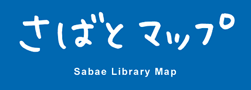

# 鯖江市図書館マップ「さばとマップ」



## 対象プラットフォーム

- iOS (iOS8.3+)
- Android (4.4+)

## ビルド手順

```bash
npm install -g cordova
npm update
cordova platform add ios
cordova platform add android
npm start
cordova run ios
cordova run android
```

## 変更の反映

```bash
cordova prepare
```

## デバッグ

ブラウザの開発コンソールでエラーを見る

### iOS

Safari → 開発　→ シミュレーターもしくは実機

## Android

ChromeのURLに以下を入力

```
chrome://inspect/
```

端末をinspect


## Windowsでgradleへのパスが見つからない場合

https://gradle.org/releases/
Gradleのバイナリーを解凍してbinフォルダへPathを通す
例) set PATH=%PATH%;C:\Users\deguc\Desktop\gradle-5.6.2\bin\

```powershell
$PATH = [Environment]::GetEnvironmentVariable("PATH")
$gradle_path = "C:\Users\deguc\Desktop\gradle-8.10.2\bin\"
[Environment]::SetEnvironmentVariable("PATH", "$PATH;$gradle_path")
```

## Windowsでnode-sassのビルドに失敗する場合

npm install --global --production windows-build-tools

## Android版で最初の位置情報の許可についてのメッセージが英語になる場合

\hooks\after_platform_add\update_ibeacon_plugin_message.js
が正常に動いているか確かめる

## Android版ストアへ公開
config.xmlのandroid-versionCodeとversionをあげる

https://developer.android.com/studio/publish/app-signing#sign_release
↑のやり方で署名する
1passwordから、さばとマップのkeystoreをダウンロードしてプロジェクトのルートに保存
keystoreのパスワードは、1Passwordのラベルに保存してある
keyAliasはcalil
keyPasswordはkeystoreと同じ

以下、古いやり方
npm run release
1passwordから、さばとマップのkeystoreをダウンロードしてプロジェクトのルートに保存
android_build.batの内容を1行ずつコマンドラインで実行する
keystoreのパスワードは、1Passwordのラベルに保存してある

## 更新履歴

- 2015/11/6 オープンソースとして公開

## ライセンスについて

The MIT License (MIT)

Copyright (c) 2015 CALIL Inc.

Permission is hereby granted, free of charge, to any person obtaining a copy
of this software and associated documentation files (the "Software"), to deal
in the Software without restriction, including without limitation the rights
to use, copy, modify, merge, publish, distribute, sublicense, and/or sell
copies of the Software, and to permit persons to whom the Software is
furnished to do so, subject to the following conditions:

The above copyright notice and this permission notice shall be included in all
copies or substantial portions of the Software.

THE SOFTWARE IS PROVIDED "AS IS", WITHOUT WARRANTY OF ANY KIND, EXPRESS OR
IMPLIED, INCLUDING BUT NOT LIMITED TO THE WARRANTIES OF MERCHANTABILITY,
FITNESS FOR A PARTICULAR PURPOSE AND NONINFRINGEMENT. IN NO EVENT SHALL THE
AUTHORS OR COPYRIGHT HOLDERS BE LIABLE FOR ANY CLAIM, DAMAGES OR OTHER
LIABILITY, WHETHER IN AN ACTION OF CONTRACT, TORT OR OTHERWISE, ARISING FROM,
OUT OF OR IN CONNECTION WITH THE SOFTWARE OR THE USE OR OTHER DEALINGS IN THE
SOFTWARE.

鯖江市図書館キャラクター「れさのすけ」「れさたろう」の著作権は鯖江市図書館に帰属します。
画像データは鯖江市図書館の許諾に基づきプロジェクトに同梱されていますが、再利用にあたっては鯖江市図書館にご確認ください。
このプロジェクトは鯖江市がオープンデータライセンス(CC-BY)で公開中および公開予定のデータを含んでいます。
